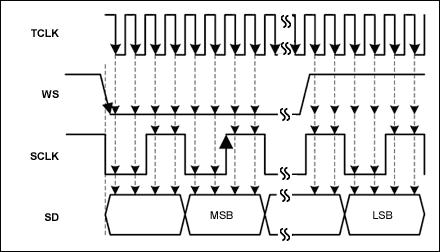

# Protocolo I2S (Inter-IC Sound)

Es un protocolo de bus serie sincronico, que se diseño especificamente para transmitir datos de **audio digital**.

Este protocolo usa principalmente tres lineas de señal **BCLOCK, RLCLOK Y SD** sin embargo tambien puede llegar a usar una cuarta linea de señal **MCLOCK**.

---
## BCLOK

Esta señal son impulsos los cuales permiten sincronisar la informacion y evitar desfaces que dañen el audio, durante la subida del impulso se lee el bit de informacion que se enviara y en la bajada se carga, de esta forma se permite que el bit de informacion se envie de forma correcta.

Su frecuencia depende de la frecuencia de muestreo, la resolución en bits y la cantidad de canales:
$$\text{Frecuencia BCLK} = F_{\text{muestreo}} \times N_{\text{bits}} \times N_{\text{canales}}$$
---
## LRCLOK

Determina a qué canal de audio corresponde el dato que se está transmitiendo. Su frecuencia es exactamente igual a la frecuencia de muestreo ($F_s$).
* **LRCLK = 0 (Nivel Bajo):** Canal Izquierdo (*Left Channel*).
* **LRCLK = 1 (Nivel Alto):** Canal Derecho (*Right Channel*).

Ademas el BCLOK tiene un ciclo de desface, ciclo en el cual ocurre el cambio de canal en el LRCLOK.

## SD 

Es la informacion del audio **PCM (Modulación por Código de Pulsos)** que se envia bit a bit a un **DAC** el cual se encarga de convertir esta informacion digital a una analoga en forma de sonido.

## MCLOK

Es una señal de reloj de alta frecuencia opcional pero requerida por muchos conversores (ADC/DAC) y DSPs para alimentar sus módulos de sobremuestreo (*oversampling*) y filtros digitales internos. Típicamente su frecuencia es $256 \times F_s$ (aunque también puede ser $128 \times F_s$, $384 \times F_s$ o $512 \times F_s$).

  

**Lo que hace diferente a este protocolo de comunicacion a los demas es que su frecuencia a la cual se envia la informacion depende de la frecuencia de muestreo a la que se tomo el audio, lo que permite que el audio se reprodusca de manera correcta sin ningun aumento o disminucion en su velocidad de reproduccion.**

Teniendo claros la funcianalidad de cada uno de los canales de reloj (MCLOK,LRCLOK y BCLOK) se porfundizara en el SD encargado de transferir la informacion.

Para  este proyecto los archivos de audio estaran en el formato .Wav

---

## Archivos .WAV

El formato .Wav es un tipo de archivo bajo el estandar **RIFF** enfocado en almacenar archivos de audio **PCM** sin compimir, mateniendolos en su estado mas puro.

### Formato RIFF

El formato RIFF esta espcialisado en el almacenamiento de archivos multimedia sin comprimir o codificar la informacion, en su lugar es una forma de almacenar la informacion en un esquema conocido como **chunks** (bloques de datos).

#### FourCC (Four-Character Code)

Cada bloque de datos inicia con una etiqueta de  cuatro caracteres ASCII (data,wave,riff) que permiten identificar que tipo de informacion esta contenida en cada chunk

#### Tamaño 

Es un valor entero de 32 bits que indica la longitud exacta de cada bloque, lo que en su momento facilita la lectura del mismo ya que se sabe donde empieza y donde termina el mismo.

#### Payload (Datos)

El contenido binario del bloque, el cual puede ser información multimedia directa o sub-bloques anidados.

### PCM (Pulse Code Modulation o Modulación por Impulsos Codificados)

Para convertir sonidos en archivos digitales, son necesarios dos procesos.

#### Frecuencia de muestreo (Sampling Rate):

consiste en medir la onda miles de veces por segundo.

>Depende de la frecuencia de muestreo del audio, por ejemplo en calidad CD (44100Hz) la señal de audio se mide 44100 veces por segundo.

#### Profundidad de bits (Bit Depth):

La profundidad de bits define la calidad con la que se mide el nivel de la muestra.

>Con 16 bits hay 65,536 niveles posibles de volumen para cada captura; con 24 bits hay más de 16 millones de niveles, lo que ofrece un rango dinámico mucho mayor.

#### ¿como se almacenan los valores?

La forma en que se almacenan los valores depende de la profundidad de bits que se usa.

En el caso de **16 a 24 bits** el cual ya es un audio de calidad se utila la representacion binaria llamada complemento a dos.
en el caso de los 16 bits el rango va de **-32768 a +32768** en esta codificacion el bit mas a la izquierda indica el signo, si es 0 el signo es positivo y si es 1 el signo es negativo.

Para archovos de 8 bits hay una excepción ya que direcatemente no se almacenan valores negativos en su lugar se desplaza el cero, teniendo un rango posible de 0 a 255 el silencio o cero se desplaza a la mitad, el valor 128,por lo tanto valores de **129 a 255** representan los ciclos positivos de la onda y de **0 a 127** los ciclos negativos de la misma.

#### Tranferencia de datos

En el protocolo I2S primero se lee la cabecera del archivo WAV, del cual se extra informacion importante como **la frecuencia de muestreo** y **el numero de canales** para posteriormente saltar a la parte de los datos, los cuales estan guardados en orden **little-endian** y codificadas en complemento a dos. 
Sin embargo el protocolo I2S tranfiere los datos een orden **big endian** por lo que en el momento de cargar los datos se reordenan los bytes

## Diagrama de flujo 

  

