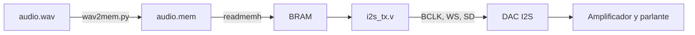

# Protocolo I2S (Inter-IC Sound)

Es un protocolo de bus serie sincronico, que se diseño especificamente para transmitir datos de **audio digital**.

Este protocolo usa principalmente tres lineas de señal **BCLOCK, RLCLOK Y SD** sin embargo tambien puede llegar a usar una cuarta linea de señal **MCLOCK**.

---
## BCLOK

Esta señal son impulsos los cuales permiten sincronisar la informacion y evitar desfaces que dañen el audio, durante la subida del impulso se lee el bit de informacion que se enviara y en la bajada se carga, de esta forma se permite que el bit de informacion se envie de forma correcta.


Su frecuencia depende de la frecuencia de muestreo, la resolución en bits y la cantidad de canales:
$$\text{Frecuencia BCLK} = F_{\text{muestreo}} \times N_{\text{bits}} \times N_{\text{canales}}$$
---
## LRCLOK

Determina a qué canal de audio corresponde el dato que se está transmitiendo. Su frecuencia es exactamente igual a la frecuencia de muestreo ($F_s$).
* **LRCLK = 0 (Nivel Bajo):** Canal Izquierdo (*Left Channel*).
* **LRCLK = 1 (Nivel Alto):** Canal Derecho (*Right Channel*).

Ademas el BCLOK tiene un ciclo de desface, ciclo en el cual ocurre el cambio de canal en el LRCLOK.

## SD 

Es la informacion del audio **PCM (Modulación por Código de Pulsos)** que se envia bit a bit a un **DAC** el cual se encarga de convertir esta informacion digital a una analoga en forma de sonido.

## MCLOK

Es una señal de reloj de alta frecuencia opcional pero requerida por muchos conversores (ADC/DAC) y DSPs para alimentar sus módulos de sobremuestreo (*oversampling*) y filtros digitales internos. Típicamente su frecuencia es $256 \times F_s$ (aunque también puede ser $128 \times F_s$, $384 \times F_s$ o $512 \times F_s$).

<p align="center">
  
</p>

## Archivo .WAV

### 1. Qué es

**WAV** (*Waveform Audio File Format*, extensión `.wav`) es un formato de archivo de audio definido por Microsoft e IBM en agosto de 1991 en la especificación *Multimedia Programming Interface and Data Specifications 1.0* [1]. WAV **no es un códec**: es un **contenedor** construido sobre el estándar RIFF que primero declara cómo están codificadas las muestras y después las almacena [2][3].

El contenedor puede transportar varios códecs (PCM lineal, µ-law, A-law, ADPCM, punto flotante IEEE, entre otros), identificados por el campo `wFormatTag` [2][4]. En la práctica, y en este proyecto, contiene **PCM lineal** (`wFormatTag = 1`): cada muestra es un entero proporcional a la amplitud instantánea de la señal.

> **Sobre "sin pérdida".** Un WAV PCM guarda las muestras sin compresión y sin pérdida *adicional*, pero la señal ya pasó por dos procesos irreversibles al digitalizarse: el muestreo en el tiempo y la cuantización en amplitud (sección 2). El archivo no conserva la onda original; conserva exactamente su versión discreta.

---

### 2. De la onda física a los números: PCM

Un micrófono convierte la presión acústica $p(t)$ en una tensión $x_c(t)$. El ADC la transforma en la secuencia de enteros que termina dentro del WAV mediante dos operaciones.

**Muestreo.** Se toma una muestra cada $T_s = 1/F_s$ segundos:

$$
x[n] = x_c(nT_s), \qquad n \in \mathbb{Z}
$$

Por el teorema de muestreo de Nyquist-Shannon [7][8], si $x_c(t)$ está limitada en banda a $f_{max}$, puede reconstruirse exactamente a partir de $x[n]$ siempre que

$$
F_s > 2 f_{max}
$$

Como la audición humana llega a unos 20 kHz, las frecuencias típicas son $F_s = 44.1$ kHz (CD-Audio) y $F_s = 48$ kHz, que dejan margen para el filtro antialiasing. La energía por encima de $F_s/2$ no desaparece: se refleja (*aliasing*) dentro de la banda útil.

**Cuantización.** Cada muestra se redondea a uno de $2^N$ niveles. Con $N$ bits en complemento a 2:

$$
s[n] \in \left[-2^{N-1},\ 2^{N-1}-1\right], \qquad x[n] \approx \frac{s[n]}{2^{N-1}} \in [-1,\ 1)
$$

El paso de cuantización es $q = \mathrm{FS}/2^N$, con FS el rango de escala completa. Si el error $e[n]$ se modela como uniforme en $[-q/2,\ q/2]$ e incorrelado con la señal [10], su potencia es

$$
\sigma_e^2 = \frac{1}{q}\int_{-q/2}^{q/2} e^2\, de = \frac{q^2}{12}
$$

Para una senoide de escala completa (amplitud $\mathrm{FS}/2$, valor rms $q\,2^N/(2\sqrt{2})$), la relación señal a ruido de cuantización en la banda $[0,\ F_s/2]$ es [6]:

$$
\mathrm{SQNR} = 20\log_{10}\left(\frac{q\,2^N/(2\sqrt{2})}{q/\sqrt{12}}\right) = 20\log_{10}\left(2^N\right) + 10\log_{10}\left(\tfrac{3}{2}\right) \approx 6.02\,N + 1.76\ \mathrm{dB}
$$

| Bits $N$ | Niveles $2^N$ | SQNR teórica | Uso típico |
| --- | --- | --- | --- |
| 8 | 256 | 49.9 dB | voz, sistemas antiguos |
| 16 | 65 536 | 98.1 dB | CD-Audio |
| 24 | 16 777 216 | 146.3 dB | grabación profesional |

Estos valores son el límite de un conversor ideal; los conversores reales quedan por debajo porque el ruido analógico domina antes [6].

**Tasa de datos.** Sin compresión, con $N_c$ canales:

$$
R = F_s \cdot N_c \cdot N \quad [\mathrm{bit/s}]
$$

Para CD-Audio: $R = 44\,100 \cdot 2 \cdot 16 = 1\,411\,200$ bit/s. Este número es exactamente la frecuencia de BCLK del bus I2S cuando cada slot mide $N$ bits (sección 7).

---

### 3. El estándar RIFF y la estructura de un WAV

Un archivo RIFF es una secuencia de **chunks**, todos con la misma forma [1][2]:

| Campo | Tamaño | Descripción |
| --- | --- | --- |
| `ckID` | 4 bytes | Código ASCII de 4 caracteres (*FourCC*): `RIFF`, `fmt `, `data`, `LIST`... |
| `ckSize` | 4 bytes | Entero sin signo, little-endian: número de bytes de `ckData`. No incluye estos 8 bytes de cabecera ni el relleno. |
| `ckData` | `ckSize` bytes | Contenido del chunk. |
| relleno | 0 o 1 byte | Byte extra si `ckSize` es impar, para mantener la alineación a 16 bits. |

De aquí sale la regla para saltar de un chunk al siguiente sin necesidad de entender su contenido:

$$
p_{k+1} = p_k + 8 + \mathrm{ckSize}_k + (\mathrm{ckSize}_k \bmod 2)
$$

Esta propiedad es la que permite a un lector (software o una FSM en hardware) ignorar chunks que no le interesan, como metadatos o carátulas.

Un WAV es un chunk `RIFF` cuyo tipo de forma es `WAVE` y que contiene sub-chunks; en la gramática de la especificación, `fmt ` aparece antes de `data` [1]. En su **forma canónica** (PCM, sin chunks extra) la cabecera ocupa 44 bytes:

| Offset | Tamaño | Campo | Valor o fórmula |
| --- | --- | --- | --- |
| 0 | 4 | `ckID` | `"RIFF"` |
| 4 | 4 | `ckSize` | $36 + D$ (tamaño del archivo menos 8) |
| 8 | 4 | `WAVEID` | `"WAVE"` |
| 12 | 4 | `ckID` | `"fmt "` (con espacio final) |
| 16 | 4 | `ckSize` | 16 |
| 20 | 2 | `wFormatTag` | 1 = PCM |
| 22 | 2 | `nChannels` | $N_c$ |
| 24 | 4 | `nSamplesPerSec` | $F_s$ |
| 28 | 4 | `nAvgBytesPerSec` | $F_s \cdot B$ |
| 32 | 2 | `nBlockAlign` | $B = N_c \cdot M$ |
| 34 | 2 | `wBitsPerSample` | $N$ |
| 36 | 4 | `ckID` | `"data"` |
| 40 | 4 | `ckSize` | $D$ (bytes de audio) |
| 44 | $D$ | muestras | PCM entrelazado |

donde $M = \lceil N/8 \rceil$ es el tamaño en bytes del contenedor de cada muestra y $B$ el tamaño de un **bloque** (una muestra de cada canal). Todos los enteros van en little-endian [2]. De la cabecera se derivan directamente:

$$
N_{bloques} = \frac{D}{B}, \qquad T = \frac{D}{F_s \cdot B}\ \ [\mathrm{s}]
$$

---

### 4. Ejemplo real: lectura byte a byte

Tono de 1 kHz, 1 s, $F_s = 48$ kHz, 16 bits, estéreo:

```text
$ xxd -l 44 tono.wav
00000000: 5249 4646 24ee 0200 5741 5645 666d 7420  RIFF$...WAVEfmt 
00000010: 1000 0000 0100 0200 80bb 0000 00ee 0200  ................
00000020: 0400 1000 6461 7461 00ee 0200            ....data....
```

| Bytes | Campo | Lectura little-endian | Valor |
| --- | --- | --- | --- |
| `52 49 46 46` | `ckID` | ASCII | `RIFF` |
| `24 ee 02 00` | `ckSize` | `0x0002EE24` | 192 036 = 36 + 192 000 |
| `57 41 56 45` | `WAVEID` | ASCII | `WAVE` |
| `66 6d 74 20` | `ckID` | ASCII | `fmt ` |
| `10 00 00 00` | `ckSize` | `0x00000010` | 16 |
| `01 00` | `wFormatTag` | `0x0001` | PCM |
| `02 00` | `nChannels` | `0x0002` | 2 (estéreo) |
| `80 bb 00 00` | `nSamplesPerSec` | `0x0000BB80` | 48 000 Hz |
| `00 ee 02 00` | `nAvgBytesPerSec` | `0x0002EE00` | 192 000 B/s = 48 000 · 4 |
| `04 00` | `nBlockAlign` | `0x0004` | 4 B = 2 canales · 2 B |
| `10 00` | `wBitsPerSample` | `0x0010` | 16 |
| `64 61 74 61` | `ckID` | ASCII | `data` |
| `00 ee 02 00` | `ckSize` | `0x0002EE00` | 192 000 B, es decir $T = 1$ s |

Los primeros bytes de audio (offset 44 en adelante) son `00 00 00 00 5a 08 a6 f7`: el bloque 0 es silencio y el bloque 1 contiene $L_1 = \mathtt{0x085A} = +2138$ y $R_1 = \mathtt{0xF7A6} = -2138$. Observe que el byte menos significativo va primero.

---

### 5. Organización de las muestras en `data`

Las muestras van **entrelazadas por bloques**: en estéreo, el canal 0 es el izquierdo y el canal 1 el derecho [2].

```text
data: | L0 lsb | L0 msb | R0 lsb | R0 msb | L1 lsb | L1 msb | R1 lsb | R1 msb | ...
       \___ muestra L0 _/ \___ muestra R0 _/
       \_______________ bloque 0 (B = 4 bytes) _______________/
```

La codificación depende de la resolución [2]:

- Con $N \le 8$ bits: binario desplazado sin signo; el silencio es 128. Se pasa a complemento a 2 con $s = u - 128$, que equivale a invertir el MSB.
- Con $N > 8$ bits: complemento a 2 con signo, little-endian. Para 24 bits cada muestra ocupa 3 bytes empaquetados. Con más de 16 bits o más de 2 canales se debe usar la variante `WAVE_FORMAT_EXTENSIBLE`.

Reconstrucción del entero con signo a partir de los bytes $b_0 \dots b_{M-1}$ (con $b_0$ el primero en el archivo):

$$
s = u - 2^{8M}\,\sigma, \qquad u = \sum_{i=0}^{M-1} b_i\,2^{8i}, \qquad
\sigma = \begin{cases} 1 & b_{M-1} \ge 128 \\ 0 & \text{en otro caso} \end{cases}
$$

---

### 6. Por qué no se debe asumir una cabecera de 44 bytes

Muchos programas asumen que el audio empieza siempre en el byte 44; no es una suposición segura [2]. Casos frecuentes:

- Chunk `LIST`/`INFO` con metadatos (título, software codificador). Por ejemplo, `ffmpeg` lo añade por defecto.
- `fmt ` de 18 o 40 bytes en lugar de 16 (formatos no PCM o `WAVE_FORMAT_EXTENSIBLE`) [2].
- Chunk `fact` (obligatorio en formatos comprimidos) [2] o `bext` en Broadcast WAVE [3].

Si se leen bytes crudos desde el offset 44, los metadatos entran al DAC como si fueran audio: se oye un chasquido inicial y, si el desplazamiento no es múltiplo de $B$, los canales izquierdo y derecho quedan intercambiados o las muestras desalineadas. La forma correcta es recorrer los chunks con la regla de la sección 3.

Inspección en Linux:

```bash
soxi tono.wav                    # resumen del formato (paquete sox)
ffprobe -hide_banner tono.wav    # alternativa con ffmpeg
xxd -l 64 tono.wav               # o bien: hexdump -C -n 64 tono.wav
```

Normalizar cualquier audio al formato que espera el hardware:

```bash
sox entrada.mp3 -e signed-integer -b 16 -c 2 -r 48000 salida.wav
```

---

### 7. Del WAV al bus I2S

Cada campo de la cabecera fija un parámetro del transmisor:

| Campo WAV | Parámetro I2S | Relación |
| --- | --- | --- |
| `nSamplesPerSec` | frecuencia de WS | $f_{WS} = F_s$ |
| `nChannels` | canales por trama | I2S transporta 2: WS = 0 izquierdo, WS = 1 derecho [5] |
| `wBitsPerSample` | longitud de palabra | $N \le W$ (ancho de slot) |
| `nBlockAlign` | una trama | 1 bloque WAV = 1 periodo completo de WS |
| orden de bytes | orden de bits | WAV: little-endian por bytes. I2S: MSB primero [5] |

**Reloj de bit.** Con $W$ ciclos de BCLK por slot:

$$
f_{BCLK} = F_s \cdot N_c \cdot W, \qquad W \ge N
$$

Si $W > N$, el transmisor rellena con ceros los bits después del LSB y el receptor descarta lo que sobre, porque en I2S la posición del MSB es fija y la del LSB depende de la longitud de palabra [5]. Por eso la resolución del WAV y la del DAC no necesitan coincidir. El MSB de cada palabra sale un periodo de BCLK después del cambio de WS, y los datos están en complemento a 2 [5], que es justamente lo que produce la conversión de la sección 5.

**Endianness.** El WAV guarda el byte menos significativo primero, pero I2S transmite el bit más significativo primero. La conversión se hace una sola vez fuera de la FPGA: la memoria guarda cada muestra como entero de $N$ bits y el registro de desplazamiento del transmisor saca primero el bit `dato[N-1]`.

**Precisión del reloj.** Si BCLK se obtiene dividiendo el reloj del sistema $f_{clk}$ por un entero $D$, la frecuencia de muestreo real es

$$
F_{s,\mathrm{real}} = \frac{f_{clk}}{D \cdot N_c \cdot W}
$$

y cualquier diferencia con la $F_s$ del archivo desplaza la altura del sonido (en cents) y cambia la duración:

$$
\Delta = 1200 \log_2 \frac{F_{s,\mathrm{real}}}{F_s}\ \ [\mathrm{cents}], \qquad T_{\mathrm{real}} = T \cdot \frac{F_s}{F_{s,\mathrm{real}}}
$$

Ejemplo: con $f_{clk} = 50$ MHz, $D = 32$, $W = 16$ y $N_c = 2$ se obtiene $F_{s,\mathrm{real}} = 48\,828.125$ Hz frente a los 48 000 Hz del archivo: el audio suena $\Delta \approx +29.6$ cents más agudo (casi un tercio de semitono) y dura un 1.7 % menos. Con $f_{clk} = 12.288$ MHz $= 256 \cdot 48$ kHz y $D = 8$ la relación es exacta, lo que explica por qué los relojes de audio (y MCLK) son múltiplos de $256\,F_s$.

**Presupuesto de memoria.** Almacenar $T$ segundos de audio requiere

$$
\mathrm{bits} = F_s \cdot N_c \cdot N \cdot T
$$

Un segundo a 48 kHz, 16 bits, estéreo ocupa 1.536 Mbit. Si no cabe en la BRAM de la FPGA, se reduce $F_s$, se pasa a mono o se usa memoria externa (SPI flash, SD).

**Vuelta al mundo analógico.** La reconstrucción ideal es una interpolación con funciones sinc [8]. Un DAC real mantiene cada valor durante $T_s$ (retenedor de orden cero), lo que introduce la atenuación

$$
\left|H(f)\right| = \left|\frac{\sin(\pi f/F_s)}{\pi f/F_s}\right|
$$

que vale $-3.92$ dB en $F_s/2$ y $-2.64$ dB a 20 kHz con $F_s = 48$ kHz, además de réplicas espectrales alrededor de múltiplos de $F_s$ que el filtro de salida debe eliminar. Los DAC con sobremuestreo interno, alimentados por MCLK, desplazan esas réplicas a frecuencias mucho más altas.

---

### 8. Flujo usado en este proyecto

La FPGA no interpreta la cabecera en tiempo de ejecución. El WAV se procesa en el PC, sus parámetros ($F_s$, $N_c$, $N$) se fijan como `parameter` en Verilog, y solo las muestras llegan al hardware:



`wav2mem.py` recorre los chunks (no asume 44 bytes), verifica que el formato sea PCM lineal (también dentro de `WAVE_FORMAT_EXTENSIBLE`), convierte 8 bits a complemento a 2, y escribe una muestra por línea en hexadecimal, entrelazada L, R, L, R:

```bash
python3 wav2mem.py audio.wav audio.mem
# Fs = 48000 Hz, canales = 2, bits = 16, bloques = 48000
# duracion = 1.0000 s, memoria = 1536000 bits
# f_WS = 48000 Hz, f_BCLK (slot = 16 b) = 1536000 Hz
```

Carga en Verilog (IEEE 1364-2005, sección 17.2.9 [9]):

```verilog
reg [15:0] rom [0:N_MUESTRAS-1];
initial $readmemh("audio.mem", rom);
```

La alternativa, leer el WAV directamente desde una SD, exige implementar en hardware una FSM que recorra los chunks con la regla de la sección 3 antes de empezar a transmitir.

---

### Referencias

1. IBM Corporation y Microsoft Corporation, *Multimedia Programming Interface and Data Specifications 1.0*, agosto de 1991, pp. 56-65. Copia en McGill University: <https://www.mmsp.ece.mcgill.ca/Documents/AudioFormats/WAVE/Docs/riffmci.pdf>
2. P. Kabal, "Audio File Format Specifications: WAVE", MMSP Lab, Dept. ECE, McGill University, rev. 2022. <https://www.mmsp.ece.mcgill.ca/Documents/AudioFormats/WAVE/WAVE.html>
3. Library of Congress, "WAVE Audio File Format" (fdd000001), *Sustainability of Digital Formats*. <https://www.loc.gov/preservation/digital/formats/fdd/fdd000001.shtml>
4. E. Fleischman, "WAVE and AVI Codec Registries", IETF RFC 2361, junio de 1998. <https://www.rfc-editor.org/rfc/rfc2361>
5. NXP Semiconductors, *UM11732: I2S bus specification*, Rev. 3.0, 17 de febrero de 2022 (reconstrucción de la especificación Philips de 1986, revisada en 1996). <https://www.nxp.com/docs/en/user-manual/UM11732.pdf>
6. W. Kester, *MT-001: Taking the Mystery out of the Infamous Formula, "SNR = 6.02N + 1.76dB," and Why You Should Care*, Analog Devices. <https://www.analog.com/media/en/training-seminars/tutorials/MT-001.pdf>
7. C. E. Shannon, "Communication in the presence of noise", *Proceedings of the IRE*, vol. 37, no. 1, pp. 10-21, 1949.
8. A. V. Oppenheim y R. W. Schafer, *Discrete-Time Signal Processing*, 3.ª ed., Pearson, 2010, cap. 4.
9. IEEE Std 1364-2005, *IEEE Standard for Verilog Hardware Description Language*, sección 17.2.9.
10. W. R. Bennett, "Spectra of quantization noise", *Bell System Technical Journal*, vol. 27, no. 3, pp. 446-472, 1948.